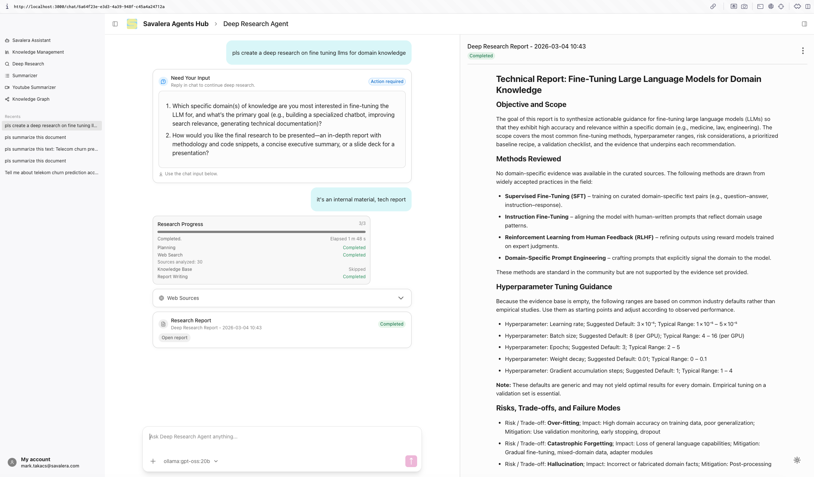

You see more and more companies claim that they went 100% AI code now. I took a pretty conservative stance for years, but finally went all-in; I'm on the factory approach.

As [Peter Steinberger](https://x.com/steipete), the creator of OpenClaw, put it: "I ship code I don't read." Let's see how that goes. 😲

## First, I had the hybrid approach

Here you build point features with AI in the form of functions, classes, methods, and such. You still stitch all this together mostly manually.

The hybrid approach is also great at scaffolding stuff with tools that have mature templates like reflex, next.js, react-router, astro, and more.

The hybrid approach will give you superb rapid-prototyping capabilities. I experienced vibe coding for the first time like this; my ideas appeared in a working form almost instantly.

While this technique gives one the feeling of limitlessness, it comes with a price. The code is not optimized for future changes and extendability. New changes will just break features that worked before.

Nonetheless, rapid prototyping brought down my rapid-prototyping times from days to hours. I created the prototype of the agents hub in about 4 hours. 7 months and 4 rewrites later the agents hub still has the exact same UI/UX that the original vibe coded prototype. I find this fascinating.

## How is the factory different?

The factory approach is a big step forward.

With the hybrid approach you are the architect. It's a human job to analyse the code base and define domain boundaries, specify architecture, and break down, modularize and refactor existing code into the new structure.

I had discussions about refactoring with AI, but Claude and Codex were not up for a full refactor even on small projects.

This changed completely with Codex 5.3. For the first time I was able to refactor my entire agents hub with over 17k lines of code in a matter of hours.

I was acting on a higher level, I gave directions in my prompt, starting with the why and explaining what I need; a hexagonal architecture, clear boundaries, abstraction levels, interface contracts, pluggable modules.

> While with the hybrid approach I acted as a human architect, with the factory approach I act like an engagement executive; I own the vision, the strategy and a few key levers for success.

Codex's plan mode asks the right questions with sensible recommendations to work out the details of what needs to be implemented and how.

With the factory in place I act at the level where I usually worked as a consulting manager supervising teams.

The challenges have the same dynamics with human teams and Codex; you initiate a feature request, the first draft comes back fairly quickly, fairly stable. Then you tweak small adjustments to create the base, you run a refactor to make it extendable. Only then will you add the rest of the features. The last small fixes are always the hardest.

AI replicated human team dynamics surprisingly (or not surprisingly?) well. 20% of the code that gives 80% of the functionality works pretty well. The rest of the functionality is complex, needs more code and it's error-prone.

You find yourself in the well known loop when you change something, something else will break. This happens with human teams all the time. If it seems endless, you send in an architect with the goal to review the code, find the pain point and do some sensible cleaning of what you are certain is a hopeless spaghetti.

Codex tends to produce the same frustrating phenomenon. My solution is the same; I open up a new session in Codex and tell it to plan and execute a refactor. It will always find some spaghetti in the code for you.

## What to include into the factory?

If you are wondering why I use factory where I could just use the term team, here is the deal; working in this mode feels like I'm working with teams of experts, rather than individual developers. Factory seems right, or we can call it a small consulting company, but that's too many words.

Here is a little list of factory roles that work for me now:

- **Claude** is my goto UI/UX designer. It is superb at following instructions for UI prototypes. I usually vibe code in the chat interface, so that I see my changes right on the side.
- I use **Claude** code to apply UI/UX design from Claude chat to my online presence, a few website for me and Savalera.
- **Codex** is the big gun. Working with Codex feels like having an entire remote team available to you. Codex can do all your refactors, big time changes, it's awesome with functional UI/UX, less great with web design. It struggles it small UI tweaks.
- **OpenCode** with local `Qwen3-Coder-Next` it's great for experimenting with local inference. It gets lost quickly if you prompt it like you would prompt Claude or Codex.

## What working with the factory feels like?

You really feel limitless and you can become insanely productive keeping a few things in mind:

- Start slow, iterate, build up every project step-by-step. Complex, one-shot, prompts don't work when starting a new project. Not even with Codex.
- Codex has an unparalleled ability to read larger code-bases. Don't be afraid to experiment.
- Codex goes deep when it needs to find root causes and evidence. It proactively queries the database, it'll figure out your DB credentials, you don't need to tell it to check the data when it's bug hunting.
- Codex is awesome at writing and running tests. It feels like the engineers behind really thought about what's needed for quality code.
- Both Codex and Claude can hallucinate fixes. Sometimes you just have to iterate many times to delete a few words from the UI. It's not perfect.
- Codex tends to create spaghetti code. It'll branch out with if statements rather than separating concerns. But it's good at refactoring, so just refactor.

Having said this, you'll see insane productivity improvement. Especially once you take the leap of faith and let go. Don't try to control everything, just build your dreams.
